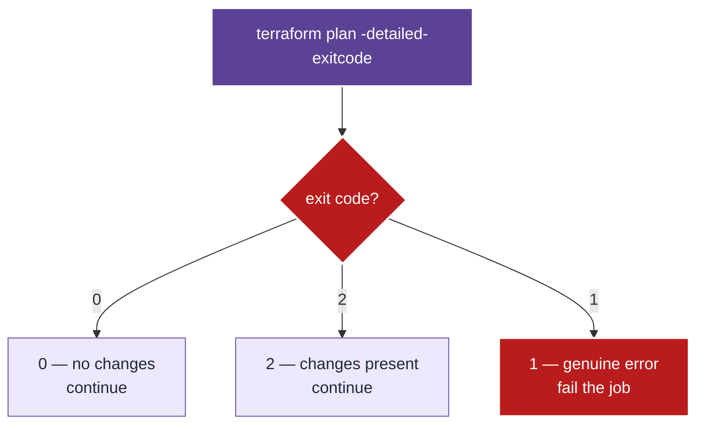

# `terraform` action

Authenticates to AWS via OIDC, initialises one stack against its
per-environment partial backend, and plans or applies it. Every Terraform
operation in this repository goes through it, so the way a plan is produced is
stated once rather than in seven workflows.

Its one real property: **apply applies the saved plan**, never a freshly
computed one. What CI showed a reviewer is what lands.

## Quickstart

```yaml
- uses: actions/checkout@v6
- uses: ./.github/actions/terraform
  with:
    env: dev
    stack: api
    action: plan
    aws_role_arn: ${{ vars.AWS_ROLE_ARN }}
    aws_region: ${{ vars.AWS_REGION }}
    build_app: "true" # only the `api` stack needs this
```

To reproduce the static half locally, without cloud or state:

```sh
make tf-check
```

The most useful knob is `build_app`. Only the `api` stack sets it, because only
that stack's `archive_file` zips a directory that does not exist until the
bundle is built — a plan without it fails on a missing path, which reads like an
infrastructure problem and is not one.

## Architecture

```mermaid
flowchart LR
    build["build the API bundle<br/>only when build_app"]:::secondary
    oidc["assume the deployer role<br/>via OIDC"]:::primary
    init["init -backend-config=<br/>backends/ENV.config"]:::primary
    plan["plan -out=tfplan<br/>-detailed-exitcode"]:::primary
    summary["write the plan to<br/>the run summary"]:::secondary
    apply["apply tfplan<br/>only when action=apply"]:::primary

    build --> oidc --> init --> plan --> summary --> apply

    classDef primary fill:#5c4295,stroke:#fff,color:#fff,stroke-width:2px
    classDef secondary fill:#ede8fb,stroke:#7259b4,color:#1e293b,stroke-width:1px
```



*Plan always runs, apply is conditional, and apply consumes the artefact plan
produced — so the two can never disagree.*

<details>
<summary>Why <code>-detailed-exitcode</code> needs handling</summary>



`-detailed-exitcode` returns **2** for "there are changes", which is the normal
outcome of nearly every plan. Treating a non-zero exit as failure would make the
action fail on every meaningful change; only **1** is an error.

</details>

## Reference

### Inputs

| Input | Required | Default | Purpose |
|---|---|---|---|
| `env` | yes | — | `dev` \| `test` \| `prod`. Selects the backend config and the `environment` variable. |
| `stack` | yes | — | Directory name under `infra/stacks/`. |
| `action` | yes | — | `plan` or `apply`. `plan` always runs; `apply` additionally consumes the saved plan. |
| `aws_role_arn` | yes | — | Deployer role assumed via OIDC. |
| `aws_region` | no | `ap-southeast-2` | Region for the AWS provider. |
| `build_app` | no | `"false"` | Build the API bundle first. Only the `api` stack needs it. |

Outputs: none. The plan is written to the job summary, and state is the durable
side effect.

### Troubleshooting

| Symptom | Cause | Fix |
|---|---|---|
| `couldn't find resource` reading an SSM parameter | The upstream stack has not been applied in this environment. | Run the cold-start workflow for that environment (ADR-0022). |
| `API bundle is empty` | `bun run --cwd api build` produced nothing. | Check the App CI build step; a broken bundle fails here rather than shipping. |
| `Error: Failed to get existing workspaces` | The state bucket does not exist. | Run `make bootstrap`. |
| Plan shows a diff on the API lambda every run | The bundle hash changed because `api/dist` was empty. | Confirm `build_app: "true"` is set for the `api` stack. |
| `AccessDenied` on AssumeRole | `vars.AWS_ROLE_ARN` points at a role that does not exist. | Run `make github-environments`, which verifies the role before advertising it. |
| Apply is queued for minutes | Another run holds the S3 state lock. | Expected; `-lock-timeout=5m` waits rather than failing immediately. |

## For maintainers

See [`CLAUDE.md`](CLAUDE.md) for the decisions behind this action and the Lens
each one projects.
