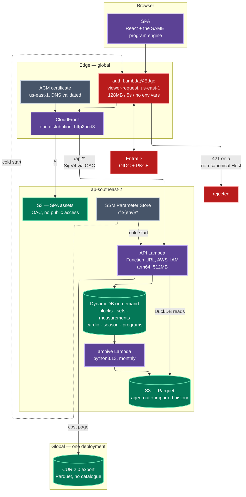
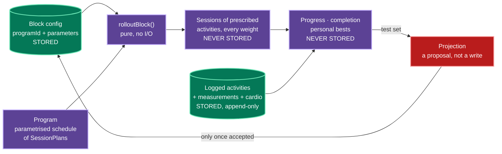
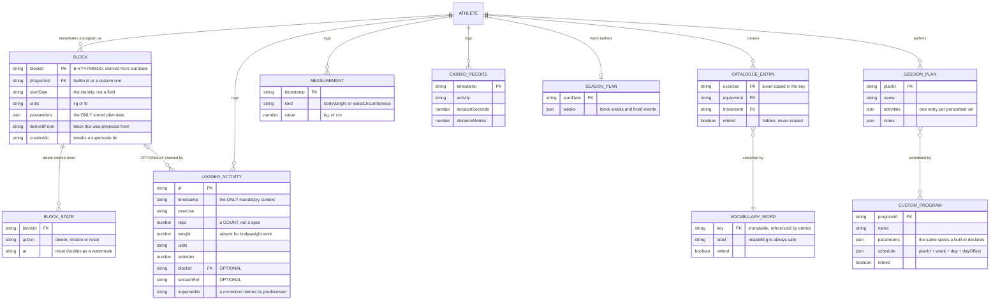
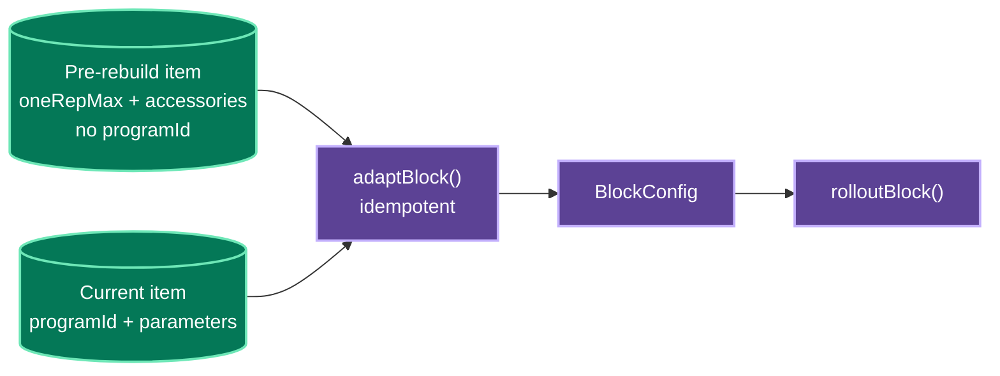
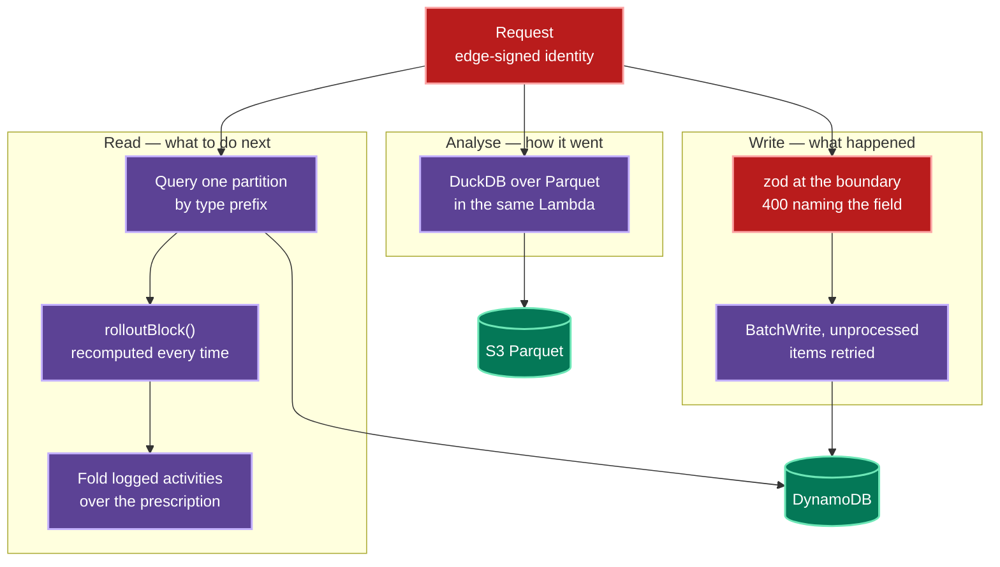
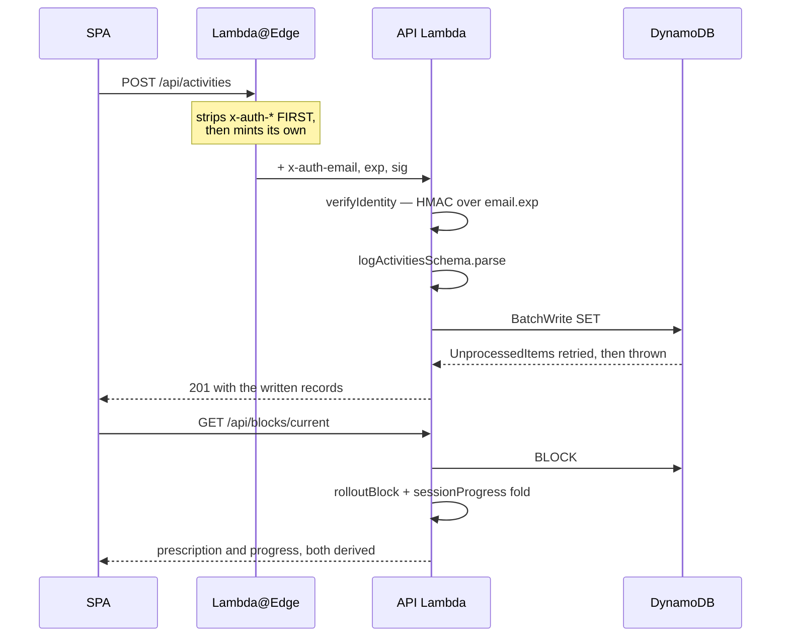
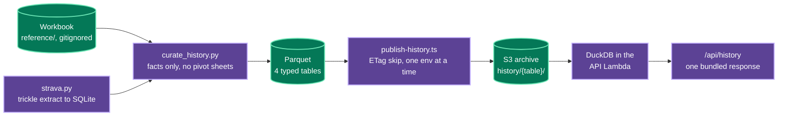
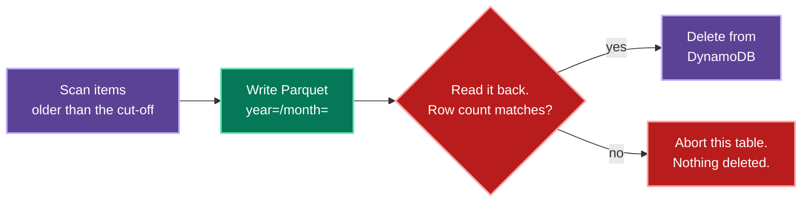

# Architecture

How `fit` is built, and — more usefully — how it fails. The **why** behind each
decision is in [`ADRs.md`](ADRs.md); this file is the shape and the failure
inventory.

## The shape



## What is deliberately absent

The most useful thing to know about this architecture is what it does not
contain, because each absence was a decision rather than an oversight.

| Not here | Why |
|---|---|
| VPC and NAT gateway | Nothing needs a private network. A NAT gateway alone would cost more per month than everything else combined. |
| Containers, ECS, a wake hook | A container-based scale-to-zero needs machinery to hide start latency: a wake function, a parked-but-resolvable origin, an error-TTL interlock so a cached 502 cannot bypass the wake path. Lambda needs none of it (ADR-0003). |
| Load balancer | CloudFront is the only ingress. |
| Relational database | The access patterns are "one user's items of one type, newest first". That is a range query, not a join. |
| A session store | The session is a signed cookie; the edge is stateless across the IdP round trip. |
| Login code in the application | Identity is asserted at the edge and verified at the origin (ADR-0009). |
| A second implementation of the program maths | Browser and server import the same module (ADR-0019). |

## The request path, in order

1. **CloudFront receives the request** and invokes the auth function at
   viewer-request, on every behaviour.
2. **The function strips every `x-auth-*` header** — first, before the host
   check, before config loads, before anything that could throw.
3. **Host is validated** against `{fqdn} ∪ extra_hosts`. A mismatch is **421**,
   never 403.
4. **`/oauth2/*` is answered at the edge.** The origin never sees those paths.
5. **The `__session` cookie is verified.** On success the function injects
   `x-auth-email`, `x-auth-exp` (300s) and `x-auth-sig = HMAC(email.exp)`.
6. **On failure**: a page request gets a 302 to the authorize URL; an `/api/*`
   request gets a **401**, because following a cross-origin redirect from
   `fetch` produces an opaque CORS failure the SPA cannot act on.
7. **CloudFront routes** `/*` to S3 via OAC, `/api/*` to the Function URL,
   signing with SigV4 via a second OAC.
8. **The origin verifies the signature** and trusts nothing else.

### Why the signature covers `email.exp` together

Signing them separately, or signing only the email, would let a header pair
captured from one response be recombined with a different address, or replayed
past its expiry. Binding them makes both attacks fail on the same check.

## The domain model

The training domain in [`docs/domain-model.md`](docs/domain-model.md) is what the
application *means*. This is what it is *made of* — the entities that exist, and
which of them are stored at all.

The organising rule is that the model has exactly two kinds of thing:
**configuration**, which is written and superseded, and **observation**, which is
appended and never rewritten. Everything else — every prescribed weight, every
completion state, every personal best — is a *third* kind that is not stored
anywhere, because it is a function of the first two (ADR-0001).



The loop closing back on the block config is the application in one edge: a block
ends by proposing the next one's seed, and that proposal only becomes
configuration when the athlete accepts it.

The **atom** is an ExerciseActivity: one set of reps of one exercise. Prescribed
and logged are different types, not two states of one type, and **a logged
activity needs nothing but a timestamp** — its links to a block and a session are
optional metadata (ADR-0036).

<details>
<summary><strong>Every entity, with its attributes and relationships</strong></summary>



Four relationships are worth reading twice.

**`LOGGED_ACTIVITY` claims its block rather than being claimed by it**, and the
claim is optional. A set logged outside any block is ordinary data, not an
orphan; a set logged from a session carries `blockId`, `week` and `day` from the
moment it is written, so session progress is a fold over observations rather than
a status field that can disagree with them.

**`BLOCK` stores parameters, not a plan.** Which program, and what it was given.
Every session, activity and weight is projected on read, which is what lets a
corrected max re-project six weeks from one write.

**`SESSION_PLAN` and `CUSTOM_PROGRAM` are the same structures the built-ins
emit** (ADR-0037). There is no second engine and no reduced capability — a stored
plan compiles to the identical interface `Candito 6-Week` implements.

**`BLOCK_STATE` is a sibling of the block, not a column on it.** Delete, restore
and reset are all appended records, because the API role has no `DeleteItem`
(ADR-0013). Latest-per-block wins, which makes restore a first-class action
rather than a recovery procedure, and makes reset a *watermark* — activities
logged at or before it stop counting toward progress without being unrecorded.

</details>

### Where each entity lives

| Logical table | Sort-key prefix | Kind | Aged out? |
|---|---|---|---|
| `blocks` | `BLOCK#{startDate}#{blockId}` | configuration | no — a block is the plan |
| `blocks` | `BSTATE#{blockId}#{at}` | configuration | no |
| `sets` | `SET#{timestamp}#{id}` | observation | yes, after 13 months |
| `measurements` | `MEASURE#{timestamp}#{id}` | observation | yes |
| `cardio` | `CARDIO#{timestamp}#{id}` | observation | yes |
| `season` | `SEASON#{startDate}#plan` | configuration | no |
| `catalogue` | `EXERCISE#{lower}` · `EQUIPMENT#{key}` · `MOVEMENT#{key}` | configuration | no |
| `programs` | `PLAN#{planId}` · `PROGDEF#{programId}` | configuration | no |

Configuration stays hot forever and observation ages out, which is the same
distinction the domain draws, arrived at from the cost side. `programs` is
emphatically never aged out: a block from two years ago still has to roll out,
and it cannot do that without the plans it was scheduled from.

The catalogue and plan keys carry no timestamp: an exercise or a plan is *one*
entry overwritten in place, so its key has to be stable. Exercise keys are
lower-cased so "Barbell row" and "Barbell Row" cannot quietly split a movement's
history between them.

Two prefixes are deliberately not the obvious spelling. `BSTATE#` is not
`BLOCKSTATE#` because the block query is `begins_with(sk, "BLOCK#")`, and
`PROGDEF#` is not `PROGRAM#` because plans are queried with
`begins_with(sk, "PLAN#")`. A prefix that is another prefix's prefix is a trap
this codebase has fallen into once already.

### Reading what was written before the rebuild

Storage is append-only and the API role cannot rewrite it, so the domain rebuild
had to change shape *without* a migration. It does it on read, in one function
(ADR-0038):



The adaptation is total and lossless: the old shape's nested maxes and accessory
choices are exactly the parameter set the Candito program declares, because the
program's parameters were derived from them. A pre-rebuild block therefore rolls
out to **byte-identical** sessions, which is asserted as a test rather than
assumed — the seed data deliberately writes one block in the old shape so a local
run and the e2e suite exercise the adapter rather than trusting it.

## Information processing flows

Three flows, and the useful thing about them is how little they share. Writing
is a validate-and-append with no reads; reading a prescription touches exactly
one stored item; analytics never touches DynamoDB at all.



<details>
<summary><strong>Logging an activity, and what it silently invalidates</strong></summary>



Nothing on the write path reads the block, resolves a weight, or updates a
completion counter. That is why an activity logged against a block that is later
superseded needs no migration: the next read folds the same observations over a
different prescription and gets a consistent answer.

It is also why the write path demands so little. An activity needs an exercise,
a rep count and a timestamp; `blockId` and `sessionRef` are recorded when the
client happens to know them (ADR-0036). Logging from the gym floor with no plan
open takes the same path as logging from a prescribed session.

The whole training year is one partition read, so `getBlocks` issues a single
activity query for every block rather than one per block. With a 13-month hot
window that is bounded by construction.

</details>

<details>
<summary><strong>The archive pipeline — five years of spreadsheet into SQL</strong></summary>



Only **facts** were imported: logged activities, weigh-ins, cardio, and the
exercise catalogue. The workbook's twenty-eight pivot sheets were left behind on purpose.
A pivot table imported as data is an answer with no question attached — it
cannot be re-derived, cannot be checked, and silently carries whatever
assumptions its author had in 2021. Deriving every number in SQL instead means a
disagreement with the spreadsheet is a question that can actually be settled.

The import is an **operator action**, never part of a deploy, which is why an
environment with no history answers `available: false` with a reason rather than
serving an empty chart. An empty chart is indistinguishable from a broken query.

Two joins in these queries are `ASOF`, not equality joins: bodyweight ratio on a
rep max, and watts-per-kilogram on a ride. Weigh-ins and training sessions are
independent events that rarely share a date, so requiring them to match would
drop most of the rows rather than most of the noise.

</details>

## Data

### Key design

```
pk = USER#{email}
sk = {TYPE}#{iso-timestamp}#{id}
```

Type-first so a query selects one kind of item without a filter expression — a
filter is applied *after* the read and billed for every item it discards.
Timestamp second so lexical order **is** chronological order, which is what lets
the age-out job find everything older than a cut-off with a range query instead
of a full scan. The trailing id disambiguates two items written in the same
millisecond, which happens more often than intuition suggests when a whole
session's activities are submitted at once.

### Hot and cold

DynamoDB holds a rolling **13-month** window — thirteen, not twelve, so a
year-on-year comparison is always answerable from the hot path alone.

The monthly age-out job is **copy → verify → delete**, in that order, always:



Reversed or interleaved, a failure between write and delete loses data
permanently. In this order the worst outcome is a duplicate partition —
recoverable, and de-duplicated on read by sort key.

The verify step reads the object back and counts rows. It is not ceremonial: an
S3 `PutObject` can return 200 while the object is unreadable, and deleting on
the strength of that response alone is precisely how an archive job destroys
data it believes it saved.

The archive Lambda's IAM policy grants `Scan` and `DeleteItem` but **not**
`PutItem` or `UpdateItem`. The append-only invariant is enforced in IAM rather
than trusted to the handler.

## Cross-stack communication

Stacks publish to **SSM**, never `terraform_remote_state`:

```
/fit/{env}/data/table/{logical}      /fit/{env}/api/function_url
/fit/{env}/data/archive_bucket       /fit/{env}/edge/distribution_id
/fit/{env}/auth/session_hmac_key     /fit/global/finops/bucket
                                    /fit/global/finops/prefix
```

A reader needs IAM on a parameter prefix, not the writer's state file and its
backend credentials. It also means the frontend deploy workflow resolves its
bucket and distribution at deploy time rather than from a hardcoded name that
goes stale after any rename.

### The one dependency that had to be inverted

`api` publishes its Function URL; `edge` consumes it. But the Lambda permission
that lets CloudFront invoke that URL needs *both* the function name and the
distribution ARN.

Putting it in `api` would make `api` depend on `edge` for the ARN while `edge`
already depends on `api` for the origin — a cycle escapable only by widening the
permission to every distribution in the account. It lives in `edge` instead, so
the dependency runs one way and the scope stays exactly one distribution.

## Failure inventory

| Condition | Response | Why that response |
|---|---|---|
| `Host` not in the allow-list | **421** | A 403 would be laundered into the app by the SPA fallback. |
| Client secret unseeded | **500** naming the SSM parameter | A generic 403 is indistinguishable from a real denial. |
| Nonce mismatch / no txn cookie | **403** before any token exchange | Blocks login-CSRF. |
| Bad signature, issuer, audience or expiry | **403**, indistinguishable | No oracle for which check failed. |
| Wrong tenant, or address not allow-listed | **403** with a sign-out link | Both checks; the tenant alone admits the whole directory. |
| `/api/*` with no session | **401** JSON | The SPA can act on it; a 302 becomes an opaque CORS error. |
| Parquet prefix is empty | `available: false` with the reason | Decided by listing the prefix, not by reading an error string. |
| FinOps stack not deployed | `available: false` with the reason | Zeros would look like a free account. |
| Parquet verify fails | abort that table, delete nothing | Data loss is the one unrecoverable outcome. |
| pyarrow layer missing | **cold-start crash** | Silently skipping the write would delete items with nothing in their place. |
| A block names a program that does not resolve | **409** on its sessions, and it still LISTS | An empty session list reads as "you have nothing to do". The training it recorded still stands. |
| A custom program's schedule names a missing plan | **compile-time throw**, program dropped from the picker with the reason | A schedule that silently loses a day produces a block that looks complete and is missing a session. |
| A load references an undeclared parameter | **warning**, and the set renders with no weight | An author mid-edit routinely has one; a 400 would make the editor unusable. |
| A pre-rebuild block is read | adapted in place, byte-identical sessions | The API role cannot rewrite history, so shape changes happen on read (ADR-0038). |

## Regional split

`ap-southeast-2` for everything with a choice. `us-east-1` for exactly three
things AWS gives no choice about:

1. the ACM certificate CloudFront consumes,
2. the Lambda@Edge function,
3. the Cost and Usage Report definition.

Lambda@Edge has **no environment variables**, so the auth function's
configuration is synthesized into its deployment bundle as `config.json` at plan
time. That file does not exist in the source tree, and looking for it in
`src/auth/` is a known dead end. Its sources are also listed *explicitly* in the
`archive_file` block: a module that is imported but not listed passes every
local test and then fails at the edge with a resolution error.

The function's SSM client is pinned to the parameter region. Unpinned, it would
look for parameters in whichever replica region served the request — a bug that
only reproduces from certain continents.

## Cost model

| Component | Idle cost | Notes |
|---|---|---|
| Route53 hosted zone | ~$0.50/mo | Shared with other applications on the apex. |
| CloudFront | $0 | Pay per request; no minimum. |
| Lambda (API + edge + archive) | $0 | Pay per invocation. |
| DynamoDB on-demand | storage only | No provisioned floor. |
| S3 (SPA, archive, CUR) | storage only | Glacier IR after 90 days for cold partitions. |
| Analytical queries | $0 | DuckDB runs inside the API Lambda; there is no query service to bill (ADR-0025). |

Every resource carries `Project`, `Environment`, `Stack` and `ManagedBy` tags
via provider `default_tags`, and `Project`/`Environment` are activated as
cost-allocation tags. With three environments in one account the tag is the
**only** thing attributing a dollar to an environment — and tag activation is
not retroactive, which is why it happens during bootstrap rather than later.

## Testing

| Layer | What it proves | Cost |
|---|---|---|
| `packages/program` golden tests | The engine reproduces the source workbook's computed cells exactly — unchanged across the domain rebuild. | $0 |
| `packages/program` program tests | 5/3/1 and 5×5 match their published shapes; a custom program rolls out through the same resolver. | $0 |
| `api` legacy tests | A block written before the rebuild rolls out byte-identically to one written after. | $0 |
| `api` identity tests | A forged, expired or recombined identity header is refused. | $0 |
| edge auth tests | Header stripping, host validation, redirect safety, token verification. | $0 |
| `tools/smoke.ts` | Every API route answers, and anonymous callers do not. | $0 |
| Playwright | The same suite against local, dev, test and prod. | $0 |

The Playwright suite runs identically in every environment, so its assertions
are written against *behaviour* rather than data — a test asserting "17 sets"
would pass in exactly one environment.

Its authentication differs by environment, and the difference is not incidental:
locally the API is handed identity headers directly, because there is no edge.
Against a deployed environment the edge **strips** those headers, so the browser
carries the signed session cookie and the edge mints the headers itself — the
same path a human takes after signing in.
