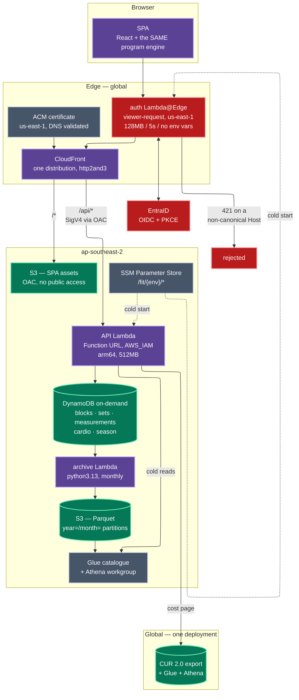
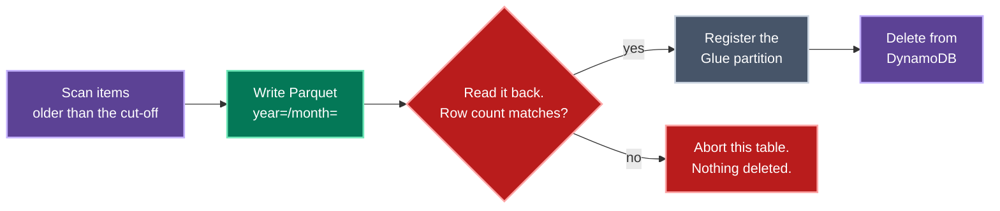

# Architecture

How `fit` is built, and — more usefully — how it fails. The **why** behind each
decision is in [`ADRs.md`](ADRs.md); this file is the shape and the failure
inventory.

## The shape



## What is deliberately absent

The most useful thing to know about this architecture is what it does not
contain, because each absence was a decision rather than an oversight.

| Not here | Why |
|---|---|
| VPC and NAT gateway | Nothing needs a private network. A NAT gateway alone would cost more per month than everything else combined. |
| Containers, ECS, a wake hook | A container-based scale-to-zero needs machinery to hide start latency: a wake function, a parked-but-resolvable origin, an error-TTL interlock so a cached 502 cannot bypass the wake path. Lambda needs none of it (ADR-0003). |
| Load balancer | CloudFront is the only ingress. |
| Relational database | The access patterns are "one user's items of one type, newest first". That is a range query, not a join. |
| A session store | The session is a signed cookie; the edge is stateless across the IdP round trip. |
| Login code in the application | Identity is asserted at the edge and verified at the origin (ADR-0009). |
| A second implementation of the program maths | Browser and server import the same module (ADR-0019). |

## The request path, in order

1. **CloudFront receives the request** and invokes the auth function at
   viewer-request, on every behaviour.
2. **The function strips every `x-auth-*` header** — first, before the host
   check, before config loads, before anything that could throw.
3. **Host is validated** against `{fqdn} ∪ extra_hosts`. A mismatch is **421**,
   never 403.
4. **`/oauth2/*` is answered at the edge.** The origin never sees those paths.
5. **The `__session` cookie is verified.** On success the function injects
   `x-auth-email`, `x-auth-exp` (300s) and `x-auth-sig = HMAC(email.exp)`.
6. **On failure**: a page request gets a 302 to the authorize URL; an `/api/*`
   request gets a **401**, because following a cross-origin redirect from
   `fetch` produces an opaque CORS failure the SPA cannot act on.
7. **CloudFront routes** `/*` to S3 via OAC, `/api/*` to the Function URL,
   signing with SigV4 via a second OAC.
8. **The origin verifies the signature** and trusts nothing else.

### Why the signature covers `email.exp` together

Signing them separately, or signing only the email, would let a header pair
captured from one response be recombined with a different address, or replayed
past its expiry. Binding them makes both attacks fail on the same check.

## Data

### Key design

```
pk = USER#{email}
sk = {TYPE}#{iso-timestamp}#{id}
```

Type-first so a query selects one kind of item without a filter expression — a
filter is applied *after* the read and billed for every item it discards.
Timestamp second so lexical order **is** chronological order, which is what lets
the age-out job find everything older than a cut-off with a range query instead
of a full scan. The trailing id disambiguates two items written in the same
millisecond, which happens more often than intuition suggests when a whole
session's sets are submitted at once.

### Hot and cold

DynamoDB holds a rolling **13-month** window — thirteen, not twelve, so a
year-on-year comparison is always answerable from the hot path alone.

The monthly age-out job is **copy → verify → delete**, in that order, always:



Reversed or interleaved, a failure between write and delete loses data
permanently. In this order the worst outcome is a duplicate partition —
recoverable, and de-duplicated on read by sort key.

The verify step reads the object back and counts rows. It is not ceremonial: an
S3 `PutObject` can return 200 while the object is unreadable, and deleting on
the strength of that response alone is precisely how an archive job destroys
data it believes it saved.

The archive Lambda's IAM policy grants `Scan` and `DeleteItem` but **not**
`PutItem` or `UpdateItem`. The append-only invariant is enforced in IAM rather
than trusted to the handler.

## Cross-stack communication

Stacks publish to **SSM**, never `terraform_remote_state`:

```
/fit/{env}/data/table/{logical}      /fit/{env}/api/function_url
/fit/{env}/data/archive_bucket       /fit/{env}/edge/distribution_id
/fit/{env}/auth/session_hmac_key     /fit/global/finops/glue_database
```

A reader needs IAM on a parameter prefix, not the writer's state file and its
backend credentials. It also means the frontend deploy workflow resolves its
bucket and distribution at deploy time rather than from a hardcoded name that
goes stale after any rename.

### The one dependency that had to be inverted

`api` publishes its Function URL; `edge` consumes it. But the Lambda permission
that lets CloudFront invoke that URL needs *both* the function name and the
distribution ARN.

Putting it in `api` would make `api` depend on `edge` for the ARN while `edge`
already depends on `api` for the origin — a cycle escapable only by widening the
permission to every distribution in the account. It lives in `edge` instead, so
the dependency runs one way and the scope stays exactly one distribution.

## Failure inventory

| Condition | Response | Why that response |
|---|---|---|
| `Host` not in the allow-list | **421** | A 403 would be laundered into the app by the SPA error rewrite. |
| Client secret unseeded | **500** naming the SSM parameter | A generic 403 is indistinguishable from a real denial. |
| Nonce mismatch / no txn cookie | **403** before any token exchange | Blocks login-CSRF. |
| Bad signature, issuer, audience or expiry | **403**, indistinguishable | No oracle for which check failed. |
| Wrong tenant, or address not allow-listed | **403** with a sign-out link | Both checks; the tenant alone admits the whole directory. |
| `/api/*` with no session | **401** JSON | The SPA can act on it; a 302 becomes an opaque CORS error. |
| Athena query exceeds 30s | error, surfaced | Blocking a page load longer is worse than reporting it. |
| FinOps stack not deployed | `available: false` with the reason | Zeros would look like a free account. |
| Parquet verify fails | abort that table, delete nothing | Data loss is the one unrecoverable outcome. |
| pyarrow layer missing | **cold-start crash** | Silently skipping the write would delete items with nothing in their place. |

## Regional split

`ap-southeast-2` for everything with a choice. `us-east-1` for exactly three
things AWS gives no choice about:

1. the ACM certificate CloudFront consumes,
2. the Lambda@Edge function,
3. the Cost and Usage Report definition.

Lambda@Edge has **no environment variables**, so the auth function's
configuration is synthesized into its deployment bundle as `config.json` at plan
time. That file does not exist in the source tree, and looking for it in
`src/auth/` is a known dead end. Its sources are also listed *explicitly* in the
`archive_file` block: a module that is imported but not listed passes every
local test and then fails at the edge with a resolution error.

The function's SSM client is pinned to the parameter region. Unpinned, it would
look for parameters in whichever replica region served the request — a bug that
only reproduces from certain continents.

## Cost model

| Component | Idle cost | Notes |
|---|---|---|
| Route53 hosted zone | ~$0.50/mo | Shared with other applications on the apex. |
| CloudFront | $0 | Pay per request; no minimum. |
| Lambda (API + edge + archive) | $0 | Pay per invocation. |
| DynamoDB on-demand | storage only | No provisioned floor. |
| S3 (SPA, archive, CUR) | storage only | Glacier IR after 90 days for cold partitions. |
| Athena | $0 | Pay per byte scanned, capped per workgroup. |

Every resource carries `Project`, `Environment`, `Stack` and `ManagedBy` tags
via provider `default_tags`, and `Project`/`Environment` are activated as
cost-allocation tags. With three environments in one account the tag is the
**only** thing attributing a dollar to an environment — and tag activation is
not retroactive, which is why it happens during bootstrap rather than later.

## Testing

| Layer | What it proves | Cost |
|---|---|---|
| `packages/program` unit tests | The engine reproduces the source workbook's computed cells exactly. | $0 |
| `api` identity tests | A forged, expired or recombined identity header is refused. | $0 |
| edge auth tests | Header stripping, host validation, redirect safety, token verification. | $0 |
| `tools/smoke.ts` | Every API route answers, and anonymous callers do not. | $0 |
| Playwright | The same suite against local, dev, test and prod. | $0 |

The Playwright suite runs identically in every environment, so its assertions
are written against *behaviour* rather than data — a test asserting "17 sets"
would pass in exactly one environment.

Its authentication differs by environment, and the difference is not incidental:
locally the API is handed identity headers directly, because there is no edge.
Against a deployed environment the edge **strips** those headers, so the browser
carries the signed session cookie and the edge mints the headers itself — the
same path a human takes after signing in.
