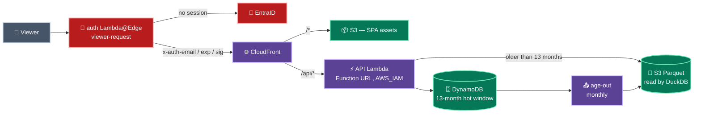

# fit

A strength-training tracker that replaces a spreadsheet. It ships the **Candito
6-Week Strength Program**, **Wendler 5/3/1** and **StrongLifts 5×5**, and lets
you build your own the same way they are built. One user, three environments,
one AWS account, and no compute running when nobody is looking at it.

```
fit-dev.jpeak.ai      fit-test.jpeak.ai      fit.jpeak.ai
```

## The idea

**The log is the point.** A logged set needs an exercise, a rep count and a
timestamp, and nothing else. You can open the app at the rack and record what you
just did with no plan, no block and no program involved. What you lifted is the
data worth keeping.

**A program is a convenience that suggests what to log.** It is a *parametrised*
schedule: give it a few numbers and it rolls out into a **block** of dated
sessions with every weight computed. Nothing prescribed is ever stored — correct
a max and the whole block moves, instantly, in the browser.

The vocabulary builds up from one atom:

```
Exercise           a movement — "Barbell Squat"
ExerciseActivity   ONE set of reps of one Exercise
  · Prescribed       what a plan suggests    (a rep SPEC, a load SPEC)
  · Logged           what actually happened  (a rep COUNT, a weight)
SessionPlan        an ordered list of prescribed activities
Program            a parametrised schedule of SessionPlans
Block              one instantiation of a Program, on the calendar
```

Prescribed and logged are deliberately **different types**. What you were told to
do and what you did are not two states of one record, and keeping them apart is
what stops the app reporting the first as though it were the second.

**Your own programs are not a lesser feature.** A session plan you author is
exactly the structure Candito emits, and it rolls out through exactly the same
resolver — same percentage-of-a-max loads, same rounding, same irregular day
offsets. The built-ins are TypeScript literals; yours are rows. Nothing else
separates them.

Read [`docs/domain-model.md`](docs/domain-model.md) for the full mechanics,
including how each program is parametrised and the two arithmetic bugs found in
the source workbook.

## Getting started

```sh
make install           # dependencies
make dev               # DynamoDB Local + API + SPA, all real handlers
make token ENV=local   # mint a session so you can sign in
```

Then open <http://localhost:5173>.

Local development runs the **same** handler modules the Lambda wraps, against
DynamoDB Local, with the same signature verification production uses. The only
things that differ are transport and backing store — there is deliberately no
`if (isLocal) skipAuth` branch anywhere in the request path.

## The inner loop

```sh
make fix ci      # format, lint, typecheck, unit tests, terraform validate
make e2e         # Playwright against the local stack
make tf-check    # terraform fmt-check + validate. No cloud, no state.

make history                    # curate reference/*.xlsx into local Parquet
make publish-history ENV=dev    # upload that archive to an environment
make duckdb-layer               # build the linux-arm64 DuckDB Lambda layer
```

`make ci` is free, offline and deterministic. Anything that spends money or
touches AWS is a **sibling** target, never a dependency of it.

## Architecture in one diagram



No VPC, no NAT gateway, no load balancer, no containers, no relational database.
Idle cost is the hosted zone, the CloudFront distribution, and stored bytes.

Full detail — including every failure mode — is in
[`ARCHITECTURE.md`](ARCHITECTURE.md).

## How it deploys

Promotion is a **Git event**, never a workflow input.

| You do this | This happens |
|---|---|
| Open a **draft** pull request | `plan` across dev, test and prod. Nothing applies. |
| Mark it **ready for review** | `apply / dev` |
| Merge to **`main`** | `apply / test` |
| Push a **`v*` tag** | `apply / prod` |

A draft pull request is therefore a genuine, zero-risk "what would this do
everywhere" report. Marking it ready is the act that first mutates cloud state,
and it mutates dev only.

Six stacks deploy independently, so a CloudFront change (fifteen minutes to
propagate) never blocks an API deploy (seconds):

| Stack | Owns | Changes when |
|---|---|---|
| `identity` | IdP credentials, the session signing key | rarely |
| `data` | DynamoDB tables, archive bucket | rarely |
| `api` | the request handler | often |
| `edge` | certificate, CloudFront, the authenticator | rarely, slowly |
| `archive` | the Parquet age-out job | rarely |
| `finops` | cost reporting — **global**, merge to `main` only | rarely |

## Sign-in

Sign in with a Microsoft account in the `jpeakai.onmicrosoft.com` tenant, on any
of the three hostnames. The app registration is `fit`
(`9f4078bd-0dac-4bb1-9e56-303979d33eb1`), single-tenant, with a redirect URI
registered for every environment and for `localhost:5173`.

Admission needs BOTH checks to pass: the token's `tid` must match the tenant,
AND the address must appear in that environment's `allowed_users` parameter. The
tenant check alone would admit every account in the directory.

OAuth terminates at a **Lambda@Edge viewer-request function**, never in the
application. It strips every inbound `x-auth-*` header before doing anything
else, rejects a non-canonical `Host` with 421, handles `/oauth2/*` entirely at
the edge, and injects a short-lived signed identity that the origin verifies.

The application has no login code, no session store, and no identity-provider
dependency. Its entire auth surface is "verify one HMAC".

### Testing a deployed environment

```sh
make token ENV=dev                       # mint a 10-minute session
bun run tools/smoke.ts --env dev         # check every API route
bun run --cwd e2e test -- --project=dev  # the full browser suite
```

The session is derived from the environment's SSM signing key at use time, using
your own AWS credentials — nothing is stored, and access to a test session is
exactly access to that parameter. Minted sessions are marked `actor=agent`, so
they are distinguishable from a human sign-in everywhere they appear.

## Standing it up from nothing

Four commands, each idempotent, each run by a human:

```sh
make bootstrap             # OIDC provider, state bucket, deployer role
make bootstrap-tags        # activate cost-allocation tags — BEFORE any spend
make github-environments   # dev/test/prod and their promotion gates
make entra                 # the OAuth app registration
```

Everything above that layer is Terraform, and Terraform runs in CI alone. The
bootstrap is the exception because it creates the role and bucket that CI needs,
so it cannot run in the pipeline it bootstraps.

> **Cost-allocation tags are not retroactive.** Spend incurred before the tags
> are activated is permanently unattributable, which is why that step runs
> before the first apply rather than after.

## Where things are

| Path | What |
|---|---|
| `packages/program/` | The domain engine: the vocabulary, the three built-in programs, the one rollout. Pure and dependency-free. |
| `api/` | The request handler, plus its Lambda and local adapters. |
| `frontend/` | The SPA. |
| `infra/bootstrap/` | The one layer a human runs. |
| `infra/modules/` | Resources live here. |
| `infra/stacks/` | Wiring and naming live here. No `resource` blocks. |
| `tools/` | Seeding, the dev runner, session minting, smoke tests. |
| `e2e/` | Playwright, one project per environment. |
| `docs/questions/` | Open questions, each with the assumption taken. |

## Documents

| Document | What it is for |
|---|---|
| [`ADRs.md`](ADRs.md) | Every structural decision, each with a forward **Lens**. |
| [`ARCHITECTURE.md`](ARCHITECTURE.md) | The deployed shape and the failure inventory. |
| [`GLOSSARY.md`](GLOSSARY.md) | The vocabulary. Read it before naming anything. |
| [`CONTRIBUTING.md`](CONTRIBUTING.md) | The loop, the invariants, and how promotion works. |
| [`CLAUDE.md`](CLAUDE.md) | Operating notes and gotchas for an agent. |
| [`docs/domain-model.md`](docs/domain-model.md) | What the training program actually is. |

## Reading order for the reasoning

1. [`ADRs.md`](ADRs.md) — every structural decision, each carrying a **Lens**:
   the forward rule it projects. Most design questions are already answered
   there.
2. [`docs/domain-model.md`](docs/domain-model.md) — what the program actually is.
3. [`ARCHITECTURE.md`](ARCHITECTURE.md) — how it is built, and how it fails.
4. [`CLAUDE.md`](CLAUDE.md) — the invariants and the gotchas.

## Licence

MIT. See [`LICENSE`](LICENSE).
