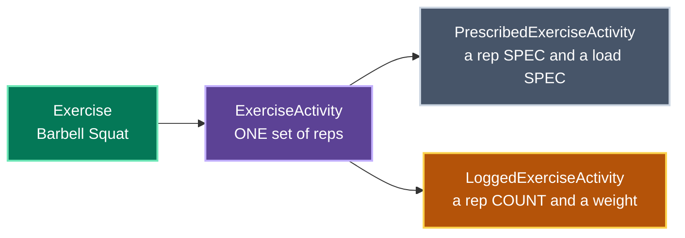
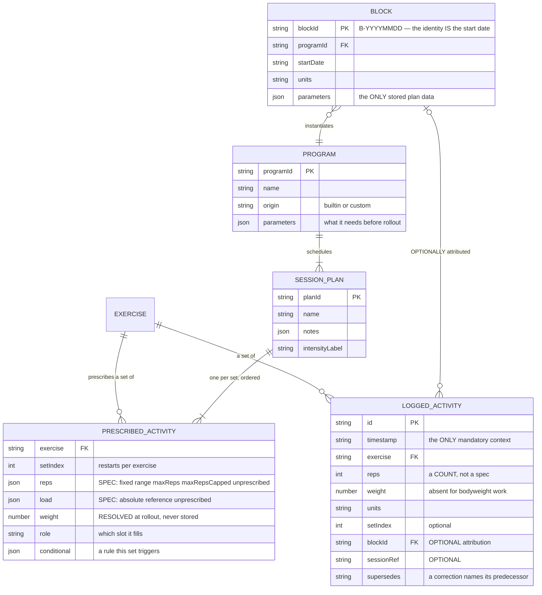
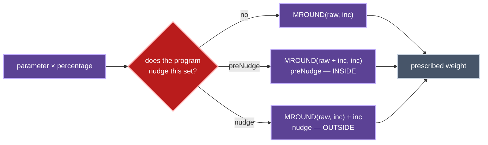
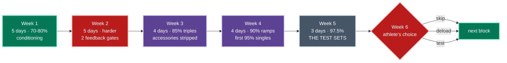
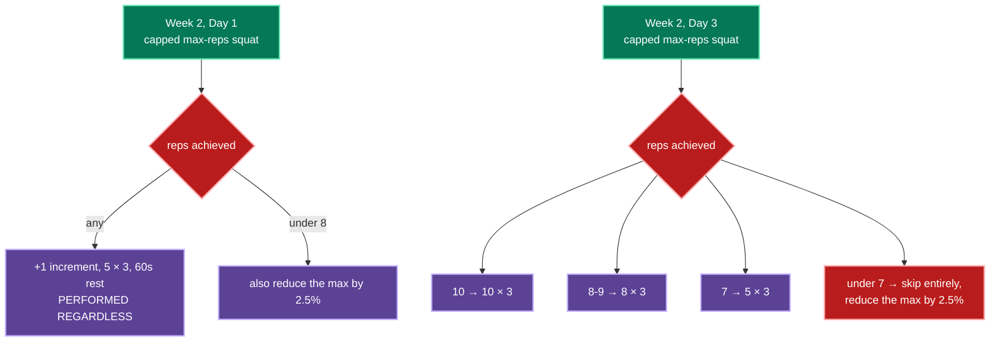
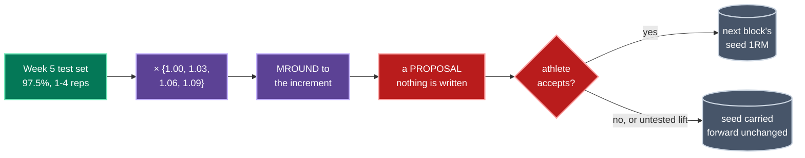
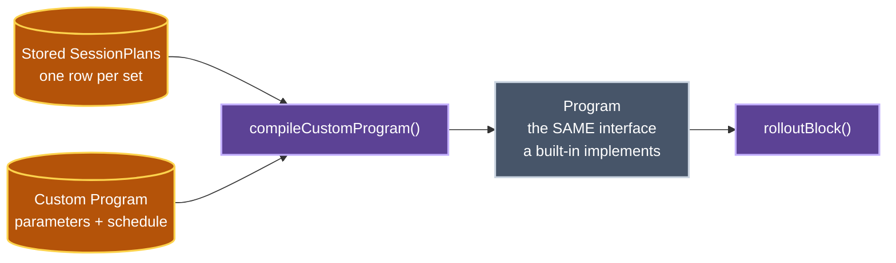
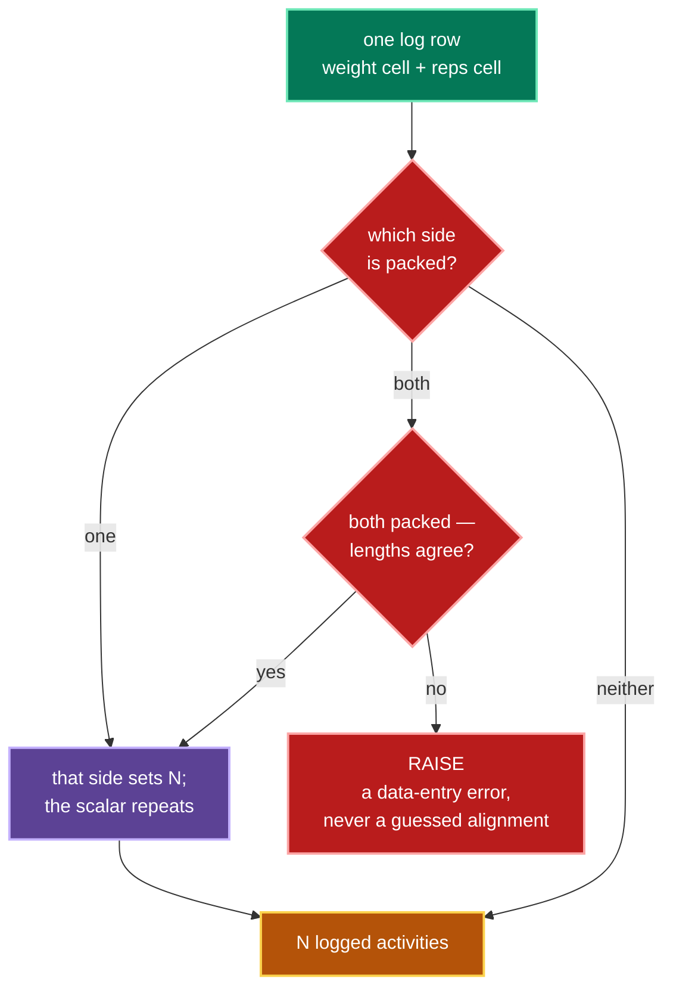

# Domain model

What the application models, built up from the atom.

```
Exercise              a specific movement — "Barbell Squat"
ExerciseActivity      ONE set of reps of one Exercise
  · Prescribed          what a plan suggests
  · Logged              what actually happened
SessionPlan           a predetermined list of prescribed activities
Program               a PARAMETRISED schedule of SessionPlans
Block                 one instantiation of a Program, on the calendar
```

The engine that implements all of it is `packages/program`, and its golden tests
assert against the source workbook's own computed cells.

## The atom: an ExerciseActivity

An **Exercise** is a movement — Barbell Squat, Lat Pulldown. What it *is* comes
from the curated catalogue; the name is its identity.

An **ExerciseActivity** is **one set of reps of one exercise**. Not "four sets of
six" — one set. A program prescribing four sets produces four activities.



**Prescribed and logged are different types, not two states of one type.** A
prescription carries a rep *spec* ("4 to 6", "max reps") and a load *spec* ("85%
of the squat max, plus one increment"). A log carries a rep *count* and a
*weight*. Collapsing them into one record with optional fields is precisely how
an application comes to report what it told you to do as though you had done it.

### Why one activity per set

"5 sets of 3" as a single record with a count cannot represent `3, 3, 3, 2, 1`.
Five records can. Every partial performance — the ordinary case, not the
exception — is only expressible because the prescription is flat.

Set numbering restarts **per exercise**, not per session. The day-one deadlift is
sets 1 and 2, not sets 5 and 6, because that is what anybody counts at the bar,
and it is what lets a logged activity line up with its prescription without a
lookup.

## Logging needs no program

**A LoggedExerciseActivity requires an exercise, a rep count and a timestamp.**
Nothing else. `blockId`, `sessionRef`, `week` and `day` are optional metadata a
session-driven log happens to know (ADR-0036).

That absence is the record: an activity with no `blockId` is deliberately outside
every block's progress and completion count. Logging is the primary act, and
programs are a convenience that suggests what to log.

<details>
<summary><strong>Both kinds, field by field</strong></summary>



</details>

## From Program to Block

A **SessionPlan** is a predetermined list of prescribed activities. It knows
nothing about dates or which block it belongs to — it is the thing authored once
("Heavy Squat Day") and scheduled many times.

A **Program** is a *parametrised* schedule of SessionPlans. Instantiating one
produces a **Block**: the plans rolled out onto the calendar with every load
resolved.


Only `parameters` is stored (ADR-0001). Every session, every activity and every
weight is projected on read, so correcting a max re-projects the whole block from
one write.

### Load specs are what unify built-in and custom

A prescribed activity's load is one of three things:

| Load spec | Meaning |
|---|---|
| `absolute` | a literal weight |
| `reference` | a percentage of a named parameter, with optional nudges |
| `unprescribed` | deliberately left to the athlete |

That single representation is why a hand-authored program is the same kind of
thing as a built-in one (ADR-0037). Both emit the same specs and both go through
`rolloutBlock`, which is the only place percentages, rounding and unit increments
are resolved. Three programs cannot grow three subtly different rounding rules
because there is one resolver.

### The rounding rule

Every referenced weight is `MROUND(parameter × percentage, increment)`, where the
increment is 2.5kg or 5lb — the smallest change that can actually be loaded on a
bar. Some weights carry an extra nudge of one increment, and **whether that nudge
falls inside or outside the rounding changes the answer**.



Nudges are counted in **increments**, not kilograms, so the intent is
unit-independent (ADR-0021). Candito's week 3 uses one form on its first squat
day and the other on its second; that difference *is* the week's built-in
progression, not an inconsistency.

### Rep notation

| Notation | Meaning | Role |
|---|---|---|
| `x6` | exactly six reps | instruction |
| `x4-6` | anywhere in four to six | instruction |
| `xMR` | max reps — go to failure | **measurement** |
| `xMR10` | max reps, stop at ten | **measurement** |
| — | the program names the exercise and declines to prescribe | free choice |

Every feedback rule in every program keys off an `MR`-shaped set. They are the
only points where a program listens back.

The last entry matters more than it looks. Candito lists two free-choice
accessories on its squat days with no set count and no rep count at all;
modelling that as *zero* activities would drop the exercise from the session
entirely, which is how a completion denominator comes to disagree with what is on
screen.

## The built-in programs

Three ship. Adding a fourth is one registry entry and no UI work, because the
parameter declarations drive the form and the schedule drives the calendar.

| Program | Shape | Parametrised by |
|---|---|---|
| **Candito 6-Week Strength** | 6 weeks, 3 lifts, feedback rules in week 2, test sets in week 5 | 3 one-rep maxes, 8 accessory slots, a week-6 choice |
| **Wendler 5/3/1** | repeating 4-week cycles, 4 lifts, one lift per day | 4 one-rep maxes, a training-max percentage, cycles, assistance |
| **StrongLifts 5×5** | 2 alternating full-body sessions, 3 days a week | 5 *working* weights, weeks, an increment |

<details>
<summary><strong>Candito 6-Week Strength — the six weeks in detail</strong></summary>

Intensity climbs while volume falls. The two max-reps sets in week 2 are the only
points before week 5 where the program listens back.



| Week | Phase | Shape |
|---|---|---|
| 1 | Muscular conditioning, moderate | 5 days. Flat volume at 70-80%, one max-reps bench set to finish. |
| 2 | Conditioning / hypertrophy, harder | 5 days. Two capped max-reps squat sets, each gating a **feedback rule**. |
| 3 | Linear max overload | 4 days. Triples at 85%, accessories stripped back to flat sixes, optional work removed entirely. |
| 4 | Heavy weight acclimation | 4 days. Ramped triples around 90%, first exposure to 95% singles. |
| 5 | High intensity strength | 3 days. One 97.5% set of 1-4 reps per lift — **these are the test sets**. |
| 6 | Retest, deload, or roll forward | The athlete's choice of three paths. |

Session dates are day offsets from the start date, exactly as the workbook
computes them: week 1 lands on days 0, 1, 3, 4, 5; week 2 on 7, 8, 10, 11, 13.
The pattern is deliberately irregular — it is a real training week, not a tiling.

**The feedback rules.** The workbook states these in prose in merged cells. The
engine makes them computable, so the app resolves them the moment the athlete
logs the set.



Day 3's back-off work is reduced by **two** increments before the band applies.
The standing rule — "if you ever fail a required rep, reduce your max by 2.5%" —
has no trigger set and no band: it applies in any session.

Every one of these produces a *new* block config rather than editing the current
one (ADR-0013), so what was believed and when stays reconstructible.

**The recursion.** Week 5's single 1-4 rep set at 97.5% is converted into a
projected one-rep max, which seeds the next block.



Beyond four reps the program is silent, because a set that runs past 4 at 97.5%
means the entered max was too low. The engine continues the table's own linear
3-points-per-rep slope, which errs toward a larger jump that week 2's feedback
rules will correct downward if it proves optimistic.

A projection is a **proposal**, not a mutation. A lift with no usable test result
carries its seed forward unchanged — an untested lift has not got weaker.

</details>

<details>
<summary><strong>Wendler 5/3/1 — the training max is the whole point</strong></summary>

Four main lifts (squat, bench, deadlift, overhead press), one per training day,
on a repeating four-week cycle.

| Week | Sets | Percentages | Last set |
|---|---|---|---|
| 1 | 5 / 5 / 5+ | 65, 75, 85% | AMRAP |
| 2 | 3 / 3 / 3+ | 70, 80, 90% | AMRAP |
| 3 | 5 / 3 / 1+ | 75, 85, 95% | AMRAP |
| 4 | 5 / 5 / 5 | 40, 50, 60% | deload, no AMRAP |

**Percentages are of the TRAINING max, not the true max.** The training max
defaults to 90% of a tested 1RM, and the whole program is calibrated around
finishing sets with reps in reserve. Feeding a true 1RM into these percentages
makes every session roughly 10% too heavy — precisely the failure the training
max exists to prevent.

The parameters therefore take a 1RM and a training-max percentage *separately*,
and the arithmetic happens in one place: a `derive` hook expands them into a
training max per lift per cycle, which the load specs then reference. Spreading
the derivation across sixty set definitions as a percentage-of-a-percentage is
how a program ends up with two disagreeing definitions of its own training max.

**Progression is between cycles, not within one.** After each four weeks the
training max rises by one increment for the presses and two for squat and
deadlift, which is why the reference key carries the cycle number.

**The `+` set is a measurement, not an instruction** — the only feedback the
program takes, modelled as `maxReps` for the same reason Candito's `MR` sets are.

Assistance offers Boring But Big (5×10 of the same lift at 50-60% of the training
max), named accessories, or none. Only BBB is modelled as a prescription; the
other published options are categories ("50-100 reps of a push, a pull and a
single-leg movement") and offering a category as though it were a prescription
would be inventing a program Wendler did not write.

</details>

<details>
<summary><strong>StrongLifts 5×5 — a straight linear ramp</strong></summary>

Two alternating full-body sessions, three days a week, on Monday/Wednesday/Friday
offsets. A week runs A, B, A; the next runs B, A, B. You squat every session.

| Workout | Exercises |
|---|---|
| **A** | Squat 5×5 · Bench Press 5×5 · Barbell Row 5×5 |
| **B** | Squat 5×5 · Overhead Press 5×5 · **Deadlift 1×5** |

**The deadlift is one set of five, not five sets.** Five sets of five deadlifts is
a different and much harder program; modelling it that way would quietly triple
the hardest lift's volume.

**Progression is per session, not per week.** The bar goes up one increment every
time a lift is performed, so the squat — trained three times a week — climbs three
times as fast as the presses. That is the entire mechanism, and it is why the
parameters are **working weights** rather than one-rep maxes: the program starts
deliberately light and lets the linear progression do the work.

The block is therefore an arithmetic ramp with no percentages of a max at all. It
is still expressed with `reference` load specs against derived per-occurrence
parameters, so it goes through the same resolver and the same rounding as
everything else.

</details>

## Custom programs

An athlete authors **SessionPlans** and composes them into a **Program**. The
result is compiled into exactly the `Program` interface the three built-ins
implement, and rolled out by exactly the same function (ADR-0037).



There is no "simple mode" and no capability a built-in has that an author cannot
reach: percentage-of-a-parameter loads, max-reps sets, irregular day offsets, and
free-choice entries are all authored the same way the built-ins declare them. The
only difference is where the definition lives — a TypeScript literal or a stored
row — and that difference stops at the compiler.

Two failures are named rather than swallowed. A schedule slot referencing a plan
that does not exist **throws at compile time**, because a schedule that silently
loses a day produces a block that looks complete and is missing a session. A load
referencing a parameter the program never declared is **reported as a warning**,
because an author mid-edit routinely has one, and a session that renders blank
for no visible reason is worse than one that says why.

## Observations

Two append-only logs beyond the training log, both timestamp-keyed, both aged out
to Parquet after 13 months (ADR-0012).

**Body measurements.** Body weight (kg) and waist circumference (cm), rolled up
weekly by **median** rather than mean — a single post-meal weigh-in moves a mean
by a kilogram, and the whole purpose of the weekly figure is to see through daily
noise.

**Cardio activities.** Rows, runs and rides, with duration and distance.

### Two different one-rep-max estimators, deliberately

| Estimator | Formula | Used for |
|---|---|---|
| Program table | `weight × {1.00, 1.03, 1.06, 1.09}` | Seeding the next Candito block. **Authoritative.** |
| Epley | `weight × (1 + reps/30)` | Charting progress across every logged activity. |

They are kept separate so that improving the progress chart can never silently
change a training plan.

## The season calendar

Blocks do not tile a year, and the gaps are the point. The season plan is
**hand-authored**: blocks are placed around fixed events — a cycling FTP test, a
timed 5km, an end-of-year break — and a fixture landing mid-block ends that block
early rather than pausing it.

So the calendar is athlete configuration, not a derivation. The only derived
value is each week's start date (start + 7n) and its month, quarter and season.
Seasons are **southern-hemisphere**: December through February is Summer.

## Importing the old logs

The source workbook's log sheets were filled by hand over months and the formats
drifted. The importer handles it in one place.



- A weight cell may read `60` or `50,60,60,60` — the latter meaning four sets.
- A reps cell may read `6` or `10,8,6`.
- Whichever column carries multiple values decides how many activities the row
  describes; the scalar side repeats across them.
- Durations appear as `2m12s` *and* `2:02`; both parse. Anything unrecognisable
  returns nothing rather than `NaN`, so a garbled cell drops out of the import
  instead of poisoning an average.

## Known deviations from the source workbook

Two formulas in the workbook appear to be units bugs, and the engine implements
the intent instead. Both are recorded, tested, and reversible — see
[`questions/Q01-spreadsheet-formula-deviations.md`](questions/Q01-spreadsheet-formula-deviations.md).

## Sources

- Candito 6-Week Strength Program — the source workbook, structure documented
  here; its data stays local (`reference/` is gitignored).
- [Wendler 5/3/1 — training max, AMRAP and deload](https://www.norma-athletics.at/guides/wendler-531/)
- [StrongLifts 5×5 — progression settings](https://support.stronglifts.com/article/71-progression)
- [StrongLifts 5×5 — program guide](https://legionathletics.com/stronglifts-5x5/)
